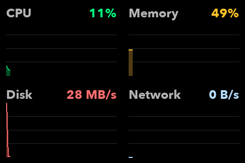

# Turing System Monitor



## 日本語

`turing_system_monitor.py` は、Turing Smart Screen 向けの 4 分割システムモニタです。  
デフォルトでは、左上に CPU、右上に Memory、左下に Disk、右下に Network の時間推移グラフを表示します。

現在のパラメタ値は、3.5 インチのディスプレイ向けに調整されています。

### 実行方法

1. 必要な Python パッケージを入れます。

```bash
python3 -m pip install pillow pyserial psutil
```

2. スクリプトを実行します。

```bash
python3 turing_system_monitor.py
```

デフォルトでは次の 4 枠を表示します。

- 左上: `cpu`
- 右上: `memory`
- 左下: `disk`
- 右下: `network`

通常向きの `LANDSCAPE` で表示したい場合:

```bash
python3 turing_system_monitor.py --landscape
```

PNG スナップショットだけを保存したい場合:

```bash
python3 turing_system_monitor.py --snapshot
```

一部の枠だけ表示したい場合:

```bash
python3 turing_system_monitor.py --top-left cpu
python3 turing_system_monitor.py --top-right memory --bottom-left disk
```

### コマンドラインオプション

- `--snapshot`
  LCD に送らず、現在の表示内容を `turing_system_monitor_snapshot.png` として保存します。
  保存される PNG は常に正立です。
- `--landscape`
  通常向きの `LANDSCAPE` で表示します。
  指定しない場合は 180 度反転した `REVERSE_LANDSCAPE` が既定です。
- `--top-left`
  左上に表示する指標を `cpu` / `memory` / `disk` / `network` から選びます。
- `--top-right`
  右上に表示する指標を `cpu` / `memory` / `disk` / `network` から選びます。
- `--bottom-left`
  左下に表示する指標を `cpu` / `memory` / `disk` / `network` から選びます。
- `--bottom-right`
  右下に表示する指標を `cpu` / `memory` / `disk` / `network` から選びます。

1 つでも位置指定をした場合は、その指定された枠だけを表示します。何も指定しない場合だけ、4 枠の既定配置になります。

### 表示仕様

- `CPU`
  `psutil.cpu_times_percent(interval=None)` の `user + system` を 0〜100% の履歴グラフで表示します。
- `Memory`
  `psutil.virtual_memory().percent` を 0〜100% の履歴グラフで表示します。
- `Disk`
  `psutil.disk_io_counters()` の `read_bytes + write_bytes` 差分を単一グラフで表示します。
  右上の値は整数の転送レートです。
- `Network`
  `psutil.net_io_counters()` の `bytes_recv + bytes_sent` 差分を単一グラフで表示します。
  右上の値は整数の転送レートです。

### 更新間隔

- サンプリング間隔: `1.0` 秒
- 画面更新判定間隔: `0.2` 秒

4 枠すべてを表示している場合は、各枠が順番に更新されるため、1 枠あたり約 `0.8` 秒ごとに更新されます。

### 設定パラメタ

以下は [`turing_system_monitor.py`](/Users/shirose/Library/CloudStorage/Dropbox/turing-smart-screen-python/turing_system_monitor.py) の先頭で変更できます。現在値もあわせて示します。

#### Font / Display

- `FONT_PATH`
  表示用フォントのパスです。
  現在値: `"/System/Library/Fonts/Avenir Next.ttc"`
- `BRIGHTNESS`
  ディスプレイ輝度です。
  現在値: `25`
- `SAMPLE_INTERVAL_SEC`
  メトリクスのサンプリング間隔です。
  現在値: `1.0`
- `DISPLAY_UPDATE_INTERVAL_SEC`
  次のパネルへ描画を回す間隔です。
  現在値: `0.2`
- `HISTORY_LEN`
  各グラフの履歴長です。
  現在値: `60`

#### Panel Geometry

- `DISPLAY_W`
  画面幅です。
  現在値: `480`
- `DISPLAY_H`
  画面高さです。
  現在値: `320`
- `PANEL_W`
  1 パネルの幅です。
  現在値: `DISPLAY_W // 2`
- `PANEL_H`
  1 パネルの高さです。
  現在値: `DISPLAY_H // 2`

#### Colors

- `COLOR_BG`
  背景色です。
  現在値: `(0, 0, 0)`
- `COLOR_LABEL`
  ラベル色です。
  現在値: `(180, 180, 180)`
- `COLOR_GRID`
  グリッド線色です。
  現在値: `(40, 40, 40)`
- `COLOR_CPU`, `COLOR_CPU_FILL`
  CPU グラフの線色と塗り色です。
- `COLOR_MEMORY`, `COLOR_MEMORY_FILL`
  Memory グラフの線色と塗り色です。
- `COLOR_DISK`, `COLOR_DISK_FILL`
  Disk グラフの線色と塗り色です。
- `COLOR_NETWORK`, `COLOR_NETWORK_FILL`
  Network グラフの線色と塗り色です。

#### Fixed Scales

- `DISK_MAX_BPS`
  Disk グラフの固定上限値です。
  現在値: `1_000_000_000.0`
- `NETWORK_MAX_BPS`
  Network グラフの固定上限値です。
  現在値: `50_000_000.0`

### 補足

- `disk` と `network` は自動スケーリングではなく固定上限で描いています。
- `disk` / `network` の右上表示値は、横幅節約のため小数なしの整数表示です。
- このスクリプトはデフォルトで 180 度反転向きの表示を使います。PNG スナップショットだけは常に正立で保存します。

## English

`turing_system_monitor.py` is a 4-quadrant system monitor for Turing Smart Screen.  
By default, it shows CPU in the top-left, Memory in the top-right, Disk in the bottom-left, and Network in the bottom-right.

The current parameter values are tuned for the 3.5-inch display.

### How to run

1. Install the required Python packages.

```bash
python3 -m pip install pillow pyserial psutil
```

2. Run the script.

```bash
python3 turing_system_monitor.py
```

The default layout is:

- Top-left: `cpu`
- Top-right: `memory`
- Bottom-left: `disk`
- Bottom-right: `network`

To use normal `LANDSCAPE` orientation:

```bash
python3 turing_system_monitor.py --landscape
```

To save only a PNG snapshot:

```bash
python3 turing_system_monitor.py --snapshot
```

To display only selected quadrants:

```bash
python3 turing_system_monitor.py --top-left cpu
python3 turing_system_monitor.py --top-right memory --bottom-left disk
```

### Command-line options

- `--snapshot`
  Saves the current display to `turing_system_monitor_snapshot.png` instead of sending it to the LCD.
  The saved PNG is always upright.
- `--landscape`
  Uses normal `LANDSCAPE` orientation.
  If omitted, the default is 180-degree rotated `REVERSE_LANDSCAPE`.
- `--top-left`
  Selects `cpu`, `memory`, `disk`, or `network` for the top-left quadrant.
- `--top-right`
  Selects `cpu`, `memory`, `disk`, or `network` for the top-right quadrant.
- `--bottom-left`
  Selects `cpu`, `memory`, `disk`, or `network` for the bottom-left quadrant.
- `--bottom-right`
  Selects `cpu`, `memory`, `disk`, or `network` for the bottom-right quadrant.

If at least one position is specified, only the specified quadrants are shown. If nothing is specified, the default 4-quadrant layout is used.

### Display behavior

- `CPU`
  Displays `user + system` from `psutil.cpu_times_percent(interval=None)` as a 0-100% history graph.
- `Memory`
  Displays `psutil.virtual_memory().percent` as a 0-100% history graph.
- `Disk`
  Displays the difference of `read_bytes + write_bytes` from `psutil.disk_io_counters()` as a single graph.
  The top-right numeric value is shown as an integer transfer rate.
- `Network`
  Displays the difference of `bytes_recv + bytes_sent` from `psutil.net_io_counters()` as a single graph.
  The top-right numeric value is shown as an integer transfer rate.

### Update intervals

- Sampling interval: `1.0` second
- Display update decision interval: `0.2` second

When all 4 quadrants are active, they are updated in rotation, so each quadrant is refreshed about every `0.8` seconds.

### Configuration parameters

You can change the following values near the top of [`turing_system_monitor.py`](/Users/shirose/Library/CloudStorage/Dropbox/turing-smart-screen-python/turing_system_monitor.py).

#### Font / Display

- `FONT_PATH`
  Font path used for rendering.
  Current value: `"/System/Library/Fonts/Avenir Next.ttc"`
- `BRIGHTNESS`
  Display brightness.
  Current value: `25`
- `SAMPLE_INTERVAL_SEC`
  Metric sampling interval.
  Current value: `1.0`
- `DISPLAY_UPDATE_INTERVAL_SEC`
  Interval used to rotate to the next panel draw.
  Current value: `0.2`
- `HISTORY_LEN`
  History length for each graph.
  Current value: `60`

#### Panel Geometry

- `DISPLAY_W`
  Display width.
  Current value: `480`
- `DISPLAY_H`
  Display height.
  Current value: `320`
- `PANEL_W`
  Width of one panel.
  Current value: `DISPLAY_W // 2`
- `PANEL_H`
  Height of one panel.
  Current value: `DISPLAY_H // 2`

#### Colors

- `COLOR_BG`
  Background color.
  Current value: `(0, 0, 0)`
- `COLOR_LABEL`
  Label color.
  Current value: `(180, 180, 180)`
- `COLOR_GRID`
  Grid line color.
  Current value: `(40, 40, 40)`
- `COLOR_CPU`, `COLOR_CPU_FILL`
  CPU graph line and fill colors.
- `COLOR_MEMORY`, `COLOR_MEMORY_FILL`
  Memory graph line and fill colors.
- `COLOR_DISK`, `COLOR_DISK_FILL`
  Disk graph line and fill colors.
- `COLOR_NETWORK`, `COLOR_NETWORK_FILL`
  Network graph line and fill colors.

#### Fixed Scales

- `DISK_MAX_BPS`
  Fixed maximum value for the Disk graph.
  Current value: `1_000_000_000.0`
- `NETWORK_MAX_BPS`
  Fixed maximum value for the Network graph.
  Current value: `50_000_000.0`

### Notes

- `disk` and `network` use fixed scales instead of auto-scaling.
- The top-right numeric values for `disk` and `network` are shown as integers to save horizontal space.
- This script uses 180-degree rotated orientation by default. Only PNG snapshots are always saved upright.
