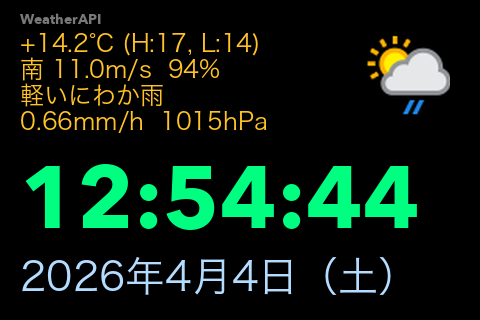

# Turing Weather Clock



## 日本語

`turing_weather_clock.py` は、Turing Smart Screen 向けの時計・天気表示スクリプトです。  
上段に天気取得ソース、小さい天気アイコン、気温、風向風速と湿度、天気文言、降水量、中段に時刻、下段に日付を表示します。

現在のパラメタ値は、3.5 インチのディスプレイ向けに調整されています。

動作確認環境:
- macOS arm64, Tahoe 26.4
- macOS intel, Tahoe 26.4

### 実行方法

1. 必要な Python パッケージを入れます。

```bash
python3 -m pip install pillow pyserial
```

2. 使用する天気 API のキーを環境変数に設定します。

WeatherAPI を使う場合:

```bash
export WEATHERAPI_KEY='YOUR_WEATHERAPI_KEY'
```

OpenWeather を使う場合:

```bash
export OPENWEATHER_API_KEY='YOUR_OPENWEATHER_API_KEY'
```

3. スクリプトを実行します。

```bash
python3 turing_weather_clock.py
```

OpenWeather を使いたい場合:

```bash
python3 turing_weather_clock.py --weather-provider openweather
```

日本語表示にしたい場合:

```bash
python3 turing_weather_clock.py --lang ja
```

通常向きの `LANDSCAPE` で表示したい場合:

```bash
python3 turing_weather_clock.py --landscape
```

PNG スナップショットだけを保存したい場合:

```bash
python3 turing_weather_clock.py --snapshot
```

通常向きで PNG スナップショットを保存したい場合:

```bash
python3 turing_weather_clock.py --snapshot --landscape
```

天気 API を使わず、時計と日付だけ表示したい場合:

```bash
python3 turing_weather_clock.py --exclude-weather
```

起動時に明るさを指定したい場合:

```bash
python3 turing_weather_clock.py --brightness 40
```

### 設定パラメタ

以下は [`turing_weather_clock.py`](/Users/shirose/Library/CloudStorage/Dropbox/turing-smart-screen-python/turing_weather_clock.py) の先頭で変更できます。現在値もあわせて示します。

#### Font Settings

- `FONT_PATH_TIME`
  時刻表示用フォントのパスです。
  候補コメントとして `Helvetica`, `Avenir Next`, `Arial Unicode` を入れてあります。
  現在値: `"/System/Library/Fonts/Avenir Next.ttc"`
- `FONT_PATH_JA`
  天気文言と日付表示用フォントのパスです。
  現在値: `"/System/Library/Fonts/ヒラギノ角ゴシック W3.ttc"`
- `FONT_PATH_SOURCE`
  天気取得ソース表示用フォントのパスです。
  現在値: `"/System/Library/Fonts/Avenir Next.ttc"`

#### Display Settings

- `BRIGHTNESS`
  ディスプレイ輝度です。
  現在値: `25`

#### Weather Box Layout

- `WEATHER_PROVIDER`
  使用する天気 API を切り替えます。
  `weatherapi` または `openweather` を指定します。
  現在値: `"weatherapi"`
- `WEATHERAPI_LOCATION`
  天気取得対象の場所です。
  例: `"Tokyo"`, `"Yokohama"`
  現在値: `"Yokohama"`
- `WEATHER_TEXT_LANG`
  天気文言の表示言語です。
  `en` または `ja` を指定します。
  `weatherapi` / `openweather` ともに、API の言語指定を `ja` / `en` で切り替えます。
  現在値: `"en"`
- `FONT_SIZE_WEATHER`
  上段の天気情報フォントサイズです。
  現在値: `24`
- `FONT_SIZE_SOURCE`
  上段最上部の天気取得ソース名フォントサイズです。
  現在値: `14`
- `WEATHER_UPDATE_MIN`
  天気 API の再取得間隔です。単位は分です。
  現在値: `5`
- `WEATHER_X`
  上段天気ボックスの左位置です。
  現在値: `20`
- `WEATHER_Y`
  上段天気ボックスの上端位置です。
  現在値: `12`
- `WEATHER_BOX_WIDTH`
  上段天気ボックスの幅です。
  現在値: `430`
- `WEATHER_BOX_HEIGHT`
  上段天気ボックスの高さです。
  現在値: `125`
- `WEATHER_TEXT_WIDTH`
  アイコンを除くテキスト描画領域の幅です。
  現在値: `330`
- `WEATHER_SOURCE_Y`
  天気取得ソース名の Y オフセットです。
  現在値: `-2`
- `WEATHER_TEMP_Y`
  気温行の Y オフセットです。
  現在値: `18`
- `WEATHER_LINE2_Y`
  上段天気ボックス2行目の Y オフセットです。
  現在値: `44`
- `WEATHER_LINE3_Y`
  上段天気ボックス3行目の Y オフセットです。
  現在値: `70`
- `WEATHER_LINE4_Y`
  上段天気ボックス4行目の Y オフセットです。
  現在値: `96`
- `WEATHER_ICON_SIZE`
  天気アイコンの表示サイズです。
  現在値: `100`
- `WEATHER_ICON_X`
  上段天気ボックス内でのアイコンの X 位置です。
  現在値: `340`
- `WEATHER_ICON_Y`
  上段天気ボックス内でのアイコンの Y 位置です。
  現在値: `10`
- `COLOR_WEATHER`
  上段の気温・風向風速・湿度・天気文言・降水量の文字色です。
  現在値: `(255, 195, 40)`
- `COLOR_SOURCE`
  上段最上部の天気取得ソース名の文字色です。
  現在値: `(120, 120, 120)`

#### Time Box Layout

- `FONT_SIZE_TIME`
  中段の時刻フォントサイズです。
  現在値: `88`
- `UPDATE_INTERVAL_SEC`
  表示更新ループの間隔です。主に時刻更新の周期に効きます。
  現在値: `0.5`
- `TIME_X`
  中段の時刻ボックスの左位置です。
  現在値: `20`
- `TIME_Y`
  中段の時刻ボックスの上端位置です。
  現在値: `140`
- `TIME_BOX_WIDTH`
  時刻ボックスの幅です。
  現在値: `430`
- `TIME_BOX_HEIGHT`
  時刻ボックスの高さです。
  現在値: `FONT_SIZE_TIME + 20`
- `COLOR_TIME`
  中段の時刻の文字色です。
  現在値: `(0, 255, 128)`

#### Date Box Layout

- `DATE_LANG`
  日付表示言語です。
  `ja` なら `2026年4月3日（金）`、`en` なら `Fri, Apr 3, 2026` 形式です。
  現在値: `"en"`
- `FONT_SIZE_DATE`
  下段の日付フォントサイズです。
  現在値: `40`
- `DATE_X`
  下段日付ボックスの左位置です。
  現在値: `20`
- `DATE_Y`
  下段日付ボックスの上端位置です。
  現在値: `230`
- `DATE_BOX_WIDTH`
  下段日付ボックスの幅です。
  現在値: `430`
- `DATE_BOX_HEIGHT`
  下段日付ボックスの高さです。
  現在値: `80`
- `DATE_LINE_Y`
  下段日付ボックス内での日付文字の Y オフセットです。
  現在値: `42`
- `COLOR_DATE`
  下段の日付の文字色です。
  現在値: `(180, 220, 255)`

### API キーについて

- `WEATHER_PROVIDER = "weatherapi"` の場合:
  `WEATHERAPI_KEY` が必要です。
- `WEATHER_PROVIDER = "openweather"` の場合:
  `OPENWEATHER_API_KEY` が必要です。

キーが設定されていない場合や API 応答が壊れている場合は、明示的にエラーで停止します。

### コマンドラインオプション

- `--snapshot`
  LCD に送らず、現在の表示内容を `turing_weather_clock_snapshot.png` として保存します。
- `--landscape`
  通常向きの `LANDSCAPE` で表示します。
  指定しない場合は 180 度反転した `REVERSE_LANDSCAPE` が既定です。
- `--weather-provider`
  天気 API を `weatherapi` または `openweather` から選択します。
  既定値は `weatherapi` です。
- `--lang`
  天気文言と日付言語をまとめて `ja` / `en` で切り替えます。
  既定値は `en` です。
- `--exclude-weather`
  天気ブロックを描画せず、時刻と日付だけを表示します。
  このモードでは天気 API を呼ばないため、API キーなしで使えます。
- `--brightness`
  LCD の明るさを `0` から `100` の整数で指定します。
  指定しない場合は `BRIGHTNESS` の設定値 `25` を使います。

### 補足

- WeatherAPI 使用時:
  `current.json` に加えて `forecast.json` も参照し、気温行に当日の `H/L` を表示します。
- OpenWeather 使用時:
  予想最高/最低気温は取得しないため、気温行は現在気温のみ表示します。
  降水量は `rain["1h"]` と `snow["1h"]` を合算して表示します。
- 風向きは日本語時のみ自前辞書で日本語方位に変換します。英語時は API の方位記号をそのまま使います。
- 気圧は降水量の後ろに `1008hPa` の形式で表示します。
- 上段天気ブロックの表示順は `気温 -> 風・湿度 -> 文言 -> 降水量` です。
- 天気テキストはアイコンと重ならないよう、左側の専用描画領域に制限しています。
- macOS + Rev.A 環境では、フォントサイズや文字色を変えると通信が不安定になることがあります。
  具体的には、表示直後や更新時に `Device not configured` などで停止する場合があります。
  特にフォントを小さくしすぎる、または色を強く変える変更は、実機で都度確認してください。

### 表示例

表示例は上の画像 [`turing_weather_clock_snapshot.png`](/Users/shirose/Library/CloudStorage/Dropbox/turing-smart-screen-python/turing_weather_clock_snapshot.png) を参照してください。

### 謝辞

このスクリプトの作成と調整には Claude と Codex の支援を利用しました。

---

## English

`turing_weather_clock.py` is a clock and weather display script for Turing Smart Screen.  
It shows the weather source label, a small weather icon, temperature, wind with humidity, weather text, precipitation on the top area, time in the middle, and date at the bottom.

The current parameter values are tuned for a 3.5-inch display.

Verified environments:
- macOS arm64, Tahoe 26.4
- macOS intel, Tahoe 26.4

### How To Run

1. Install required Python packages.

```bash
python3 -m pip install pillow pyserial
```

2. Set the API key as an environment variable.

For WeatherAPI:

```bash
export WEATHERAPI_KEY='YOUR_WEATHERAPI_KEY'
```

For OpenWeather:

```bash
export OPENWEATHER_API_KEY='YOUR_OPENWEATHER_API_KEY'
```

3. Run the script.

```bash
python3 turing_weather_clock.py
```

If you want to use OpenWeather instead:

```bash
python3 turing_weather_clock.py --weather-provider openweather
```

If you want Japanese weather text and date formatting:

```bash
python3 turing_weather_clock.py --lang ja
```

If you want normal `LANDSCAPE` orientation:

```bash
python3 turing_weather_clock.py --landscape
```

If you want to save a PNG snapshot instead of sending to the LCD:

```bash
python3 turing_weather_clock.py --snapshot
```

If you want a PNG snapshot using normal orientation:

```bash
python3 turing_weather_clock.py --snapshot --landscape
```

If you want to use it as a clock without any weather API access:

```bash
python3 turing_weather_clock.py --exclude-weather
```

If you want to set brightness at startup:

```bash
python3 turing_weather_clock.py --brightness 40
```

### Configurable Parameters

The following parameters can be edited near the top of [`turing_weather_clock.py`](/Users/shirose/Library/CloudStorage/Dropbox/turing-smart-screen-python/turing_weather_clock.py). Current values are also shown.

#### Font Settings

- `FONT_PATH_TIME`
  Font path for the time display.
  Current value: `"/System/Library/Fonts/Avenir Next.ttc"`
- `FONT_PATH_JA`
  Font path for weather text and date display.
  Current value: `"/System/Library/Fonts/ヒラギノ角ゴシック W3.ttc"`
- `FONT_PATH_SOURCE`
  Font path for the weather source label.
  Current value: `"/System/Library/Fonts/Avenir Next.ttc"`

#### Display Settings

- `BRIGHTNESS`
  Display brightness.
  Current value: `25`

#### Weather Box Layout

- `WEATHER_PROVIDER`
  Selects the weather API provider.
  Supported values: `weatherapi`, `openweather`
  Current value: `"weatherapi"`
- `WEATHERAPI_LOCATION`
  Location used for weather lookup.
  Example: `"Tokyo"`, `"Yokohama"`
  Current value: `"Yokohama"`
- `WEATHER_TEXT_LANG`
  Display language for weather text.
  Supported values: `en`, `ja`
  Both `weatherapi` and `openweather` switch the API language using this setting.
  Current value: `"en"`
- `FONT_SIZE_WEATHER`
  Font size for the top weather area.
  Current value: `24`
- `FONT_SIZE_SOURCE`
  Font size for the small weather source label at the very top.
  Current value: `14`
- `WEATHER_UPDATE_MIN`
  Weather refresh interval in minutes.
  Current value: `5`
- `WEATHER_X`
  Left position of the top weather box.
  Current value: `20`
- `WEATHER_Y`
  Top position of the top weather box.
  Current value: `12`
- `WEATHER_BOX_WIDTH`
  Width of the top weather box.
  Current value: `430`
- `WEATHER_BOX_HEIGHT`
  Height of the top weather box.
  Current value: `125`
- `WEATHER_TEXT_WIDTH`
  Width of the text-only area to the left of the icon.
  Current value: `330`
- `WEATHER_SOURCE_Y`
  Y offset for the source label.
  Current value: `-2`
- `WEATHER_TEMP_Y`
  Y offset for the temperature line.
  Current value: `18`
- `WEATHER_LINE2_Y`
  Y offset for line 2 inside the top weather box.
  Current value: `44`
- `WEATHER_LINE3_Y`
  Y offset for line 3 inside the top weather box.
  Current value: `70`
- `WEATHER_LINE4_Y`
  Y offset for line 4 inside the top weather box.
  Current value: `96`
- `WEATHER_ICON_SIZE`
  Rendered size of the weather icon.
  Current value: `100`
- `WEATHER_ICON_X`
  Icon X position inside the top box.
  Current value: `340`
- `WEATHER_ICON_Y`
  Icon Y position inside the top box.
  Current value: `10`
- `COLOR_WEATHER`
  Text color for temperature, wind, weather text, and precipitation.
  Current value: `(255, 195, 40)`
- `COLOR_SOURCE`
  Text color for the source label.
  Current value: `(120, 120, 120)`

#### Time Box Layout

- `FONT_SIZE_TIME`
  Font size for the middle time area.
  Current value: `88`
- `UPDATE_INTERVAL_SEC`
  Main display update loop interval in seconds.
  Current value: `0.5`
- `TIME_X`
  Left position of the time box.
  Current value: `20`
- `TIME_Y`
  Top position of the time box.
  Current value: `140`
- `TIME_BOX_WIDTH`
  Width of the time box.
  Current value: `430`
- `TIME_BOX_HEIGHT`
  Height of the time box.
  Current value: `FONT_SIZE_TIME + 20`
- `COLOR_TIME`
  Text color for the time.
  Current value: `(0, 255, 128)`

#### Date Box Layout

- `DATE_LANG`
  Display language for the date.
  `ja` gives `2026年4月3日（金）`
  `en` gives `Fri, Apr 3, 2026`
  Current value: `"en"`
- `FONT_SIZE_DATE`
  Font size for the bottom date area.
  Current value: `40`
- `DATE_X`
  Left position of the date box.
  Current value: `20`
- `DATE_Y`
  Top position of the date box.
  Current value: `230`
- `DATE_BOX_WIDTH`
  Width of the date box.
  Current value: `430`
- `DATE_BOX_HEIGHT`
  Height of the date box.
  Current value: `80`
- `DATE_LINE_Y`
  Y offset for the date text inside the date box.
  Current value: `42`
- `COLOR_DATE`
  Text color for the date.
  Current value: `(180, 220, 255)`

### API Keys

- If `WEATHER_PROVIDER = "weatherapi"`:
  `WEATHERAPI_KEY` is required.
- If `WEATHER_PROVIDER = "openweather"`:
  `OPENWEATHER_API_KEY` is required.

If a required key is missing or the API response is invalid, the script stops with an explicit error.

### Command-Line Options

- `--snapshot`
  Saves the current display as `turing_weather_clock_snapshot.png` instead of sending it to the LCD.
- `--landscape`
  Uses normal `LANDSCAPE` orientation.
  If omitted, the default is 180-degree rotated `REVERSE_LANDSCAPE`.
- `--weather-provider`
  Selects the weather API provider: `weatherapi` or `openweather`.
  The default is `weatherapi`.
- `--lang`
  Sets both weather text language and date language at the same time.
  Supported values: `ja`, `en`
  The default is `en`.
- `--exclude-weather`
  Hides the weather block and only shows time and date.
  In this mode the script does not call any weather API, so it works without API keys.
- `--brightness`
  Sets LCD brightness as an integer from `0` to `100`.
  If omitted, the configured `BRIGHTNESS` value `25` is used.

### Notes

- With WeatherAPI:
  The script uses both `current.json` and `forecast.json`, and displays daily `H/L` values on the temperature line.
- With OpenWeather:
  Daily high/low is not fetched, so only the current temperature is shown.
  Precipitation is derived from `rain["1h"] + snow["1h"]`.
- Wind direction is still converted with the built-in direction table in Japanese mode. In English mode the API direction code is shown as-is.
- Pressure is shown after precipitation in the form `1008hPa`.
- The top weather block order is `temperature -> wind/humidity -> condition text -> precipitation`.
- Weather text is clipped to a dedicated text area so it does not overlap the icon.
- On macOS + Rev.A hardware, changing font size or text color can make the display path unstable.
  In practice, the script may stop during initial draw or later updates with errors such as `Device not configured`.
  Smaller fonts and stronger color changes should always be re-verified on the actual device.

### Display Example

See the image above: [`turing_weather_clock_snapshot.png`](/Users/shirose/Library/CloudStorage/Dropbox/turing-smart-screen-python/turing_weather_clock_snapshot.png)

### Acknowledgements

This script was created and refined with assistance from Claude and Codex.
