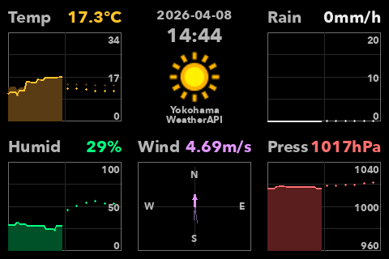

# Turing Weather Forecast Monitor



## 日本語

`turing_weather_forecast_monitor.py` は、Turing Smart Screen 向けの天気履歴・予報モニタです。  
3x2 のレイアウトで、左上に気温、上中に現在日時とアイコン、右上に降水量、左下に湿度、中下に風ベクトル、右下に気圧を表示します。

各グラフは、現在時刻を中心にして左半分に過去 6 時間の実測、右半分に未来 6 時間の予報を表示します。  
過去データは provider ごとの履歴 JSONL に追記保存し、予報データは別の provider ごとの forecast JSONL に保存します。

現在のパラメタ値は、3.5 インチのディスプレイ向けに調整されています。

### 実行方法

1. 必要な Python パッケージを入れます。

```bash
python3 -m pip install pillow pyserial
```

2. 使用する天気 API のキーを環境変数に設定します。

WeatherAPI を使う場合:

```bash
export WEATHERAPI_KEY='YOUR_WEATHERAPI_KEY'
```

OpenWeather を使う場合:

```bash
export OPENWEATHER_API_KEY='YOUR_OPENWEATHER_API_KEY'
```

3. スクリプトを実行します。

```bash
python3 turing_weather_forecast_monitor.py
```

OpenWeather を使う場合:

```bash
python3 turing_weather_forecast_monitor.py --weather-provider openweather
```

場所を指定したい場合:

```bash
python3 turing_weather_forecast_monitor.py --location Tokyo
```

通常向きの `LANDSCAPE` で表示したい場合:

```bash
python3 turing_weather_forecast_monitor.py --landscape
```

PNG スナップショットだけを保存したい場合:

```bash
python3 turing_weather_forecast_monitor.py --snapshot
```

起動時に明るさを指定したい場合:

```bash
python3 turing_weather_forecast_monitor.py --brightness 40
```

### コマンドラインオプション

- `--snapshot`
  LCD に送らず、現在の表示内容を `turing_weather_forecast_monitor_snapshot.png` として保存します。
- `--landscape`
  通常向きの `LANDSCAPE` で表示します。指定しない場合は 180 度反転した `REVERSE_LANDSCAPE` が既定です。
- `--weather-provider`
  天気 API を `weatherapi` または `openweather` から選択します。既定値は `weatherapi` です。
- `--location`
  天気取得場所を指定します。
- `--brightness`
  LCD の明るさを `0` から `100` の整数で指定します。

### 表示仕様

- `Temp`
  左半分に過去 6 時間の実気温塗りつぶしと `Feels like` の線、右半分に未来 6 時間の予報点を表示します。
- `Date / Time / Icon`
  上中パネルに現在日付、現在時刻、天気アイコン、場所、ソースを表示します。
- `Rain`
  左半分に過去 6 時間の降水量、右半分に未来 6 時間の予報点を表示します。
- `Humid`
  左半分に過去 6 時間の湿度、右半分に未来 6 時間の予報点を表示します。
- `Wind`
  過去 6 時間の風向・風速ベクトルを表示し、最新の 1 本だけを強調します。
- `Press`
  左半分に過去 6 時間の気圧、右半分に未来 6 時間の予報点を表示します。

### データファイル

実測履歴は provider ごとの JSONL に保存されます。

- `weatherapi`:
  [`turing_weather_history_weatherapi.jsonl`](/Users/shirose/Library/CloudStorage/Dropbox/turing-smart-screen-python/turing_weather_history_weatherapi.jsonl)
- `openweather`:
  [`turing_weather_history_openweather.jsonl`](/Users/shirose/Library/CloudStorage/Dropbox/turing-smart-screen-python/turing_weather_history_openweather.jsonl)

予報データは別の provider ごとの JSONL に保存されます。

- `weatherapi`:
  [`turing_weather_forecast_weatherapi.jsonl`](/Users/shirose/Library/CloudStorage/Dropbox/turing-smart-screen-python/turing_weather_forecast_weatherapi.jsonl)
- `openweather`:
  [`turing_weather_forecast_openweather.jsonl`](/Users/shirose/Library/CloudStorage/Dropbox/turing-smart-screen-python/turing_weather_forecast_openweather.jsonl)

実測 JSONL の必須キーは次です。

- `observed_at`
- `temp_c`
- `feels_like_c`
- `humidity`
- `precip_mm`
- `pressure_hpa`
- `icon_url`
- `wind_speed_mps`
- `wind_dir_deg`

予報 JSONL の必須キーは次です。

- `observed_at`
- `temp_c`
- `feels_like_c`
- `humidity`
- `precip_mm`
- `pressure_hpa`

キー欠損や型異常がある場合は、明示的にエラー停止します。

### 更新間隔

- 天気 API 再取得: `5` 分ごと
- 現在時刻とグラフ中心時刻の更新: `1` 分ごと
- 画面更新ループ: `0.2` 秒ポーリング

### 設定パラメタ

以下は [`turing_weather_forecast_monitor.py`](/Users/shirose/Library/CloudStorage/Dropbox/turing-smart-screen-python/turing_weather_forecast_monitor.py) の先頭で変更できます。現在値もあわせて示します。

#### Display / Data

- `BRIGHTNESS`
  ディスプレイ輝度です。現在値: `25`
- `WEATHER_PROVIDER`
  使用する天気 API です。現在値: `"weatherapi"`
- `WEATHER_LOCATION`
  天気取得対象の場所です。現在値: `"Yokohama"`
- `WEATHER_UPDATE_MIN`
  天気 API の再取得間隔です。現在値: `5`
- `HISTORY_FILE_TEMPLATE`
  実測履歴 JSONL のファイル名テンプレートです。現在値: `"turing_weather_history_{provider}.jsonl"`
- `FORECAST_FILE_TEMPLATE`
  予報 JSONL のファイル名テンプレートです。現在値: `"turing_weather_forecast_{provider}.jsonl"`
- `HISTORY_WINDOW_SEC`
  過去側・未来側それぞれの時間幅です。現在値: `6 * 60 * 60`

#### Layout / Ranges

- `DISPLAY_W`, `DISPLAY_H`
  画面サイズです。現在値: `480`, `320`
- `PANEL_COLS`, `PANEL_ROWS`
  パネル分割数です。現在値: `3`, `2`
- `TEMP_MIN`, `TEMP_MAX`
  気温グラフの縦軸範囲です。現在値: `0.0`, `34.0`
- `HUMIDITY_MIN`, `HUMIDITY_MAX`
  湿度グラフの縦軸範囲です。現在値: `0.0`, `100.0`
- `RAIN_MIN`, `RAIN_MAX`
  降水量グラフの縦軸範囲です。現在値: `0.0`, `20.0`
- `PRESSURE_MIN`, `PRESSURE_MAX`
  気圧グラフの縦軸範囲です。現在値: `960.0`, `1040.0`

## English

`turing_weather_forecast_monitor.py` is a weather history / forecast monitor for Turing Smart Screen.  
It uses a 3x2 layout with temperature in the top-left, date/time/icon in the top-middle, rain in the top-right, humidity in the bottom-left, wind vectors in the bottom-middle, and pressure in the bottom-right.

Each graph uses the current time as the center of the horizontal axis: the left half shows the past 6 hours of observed data, and the right half shows the next 6 hours of forecast data.

Observed data is stored in provider-specific history JSONL files, while forecast data is stored in separate provider-specific forecast JSONL files.

### How to run

1. Install the required Python packages.

```bash
python3 -m pip install pillow pyserial
```

2. Set the API key for the weather provider you want to use.

For WeatherAPI:

```bash
export WEATHERAPI_KEY='YOUR_WEATHERAPI_KEY'
```

For OpenWeather:

```bash
export OPENWEATHER_API_KEY='YOUR_OPENWEATHER_API_KEY'
```

3. Run the script.

```bash
python3 turing_weather_forecast_monitor.py
```

To use OpenWeather:

```bash
python3 turing_weather_forecast_monitor.py --weather-provider openweather
```

To set a location:

```bash
python3 turing_weather_forecast_monitor.py --location Tokyo
```

To use normal `LANDSCAPE` orientation:

```bash
python3 turing_weather_forecast_monitor.py --landscape
```

To save only a PNG snapshot:

```bash
python3 turing_weather_forecast_monitor.py --snapshot
```

To set brightness at startup:

```bash
python3 turing_weather_forecast_monitor.py --brightness 40
```

### Command-line options

- `--snapshot`
  Saves the current display to `turing_weather_forecast_monitor_snapshot.png` instead of sending it to the LCD.
- `--landscape`
  Uses normal `LANDSCAPE` orientation. If omitted, the default is 180-degree rotated `REVERSE_LANDSCAPE`.
- `--weather-provider`
  Selects `weatherapi` or `openweather`. Default: `weatherapi`.
- `--location`
  Sets the weather query location.
- `--brightness`
  Sets LCD brightness from `0` to `100`.

### Display behavior

- `Temp`
  Past 6 hours of actual temperature fill and `Feels like` line on the left, forecast dots on the right.
- `Date / Time / Icon`
  Shows current date, current time, weather icon, location, and provider.
- `Rain`
  Past 6 hours on the left, forecast dots on the right.
- `Humid`
  Past 6 hours on the left, forecast dots on the right.
- `Wind`
  Shows wind direction / speed vectors for the past 6 hours and highlights the latest one.
- `Press`
  Past 6 hours on the left, forecast dots on the right.
